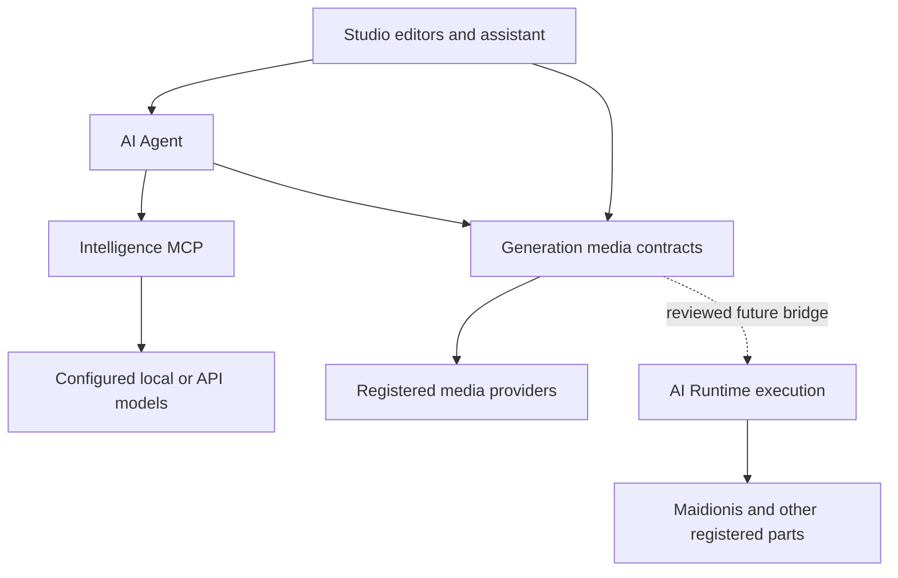

# Multimodal Studio architecture

Status: proposed design, 2026-10-02. Coordination: [#15](https://github.com/flamoris-jp/flamoris-ai/issues/15). This document defines cross-repository boundaries and gates; it does not advertise new implemented capabilities.

## Purpose

Studio should present creative operations, reusable media Workflows and a contextual AI assistant. Image, Music, Speech and Video use dedicated editors, a common result catalog and explicit availability. Music transcription belongs beside music generation; image decomposition belongs beside image generation. Provider names do not define the navigation.

The assistant is an AI Agent, independently of the model behind it. Changing the Agent's intelligence target must not require a Studio-specific provider adapter. Workflow parts may be included recursively and replaced by publishing a new pinned parent version.

## Inspected baseline

These commits were inspected before proposing the design. They are design evidence, not live deployment health:

| Repository | Main commit | Relevant current boundary |
| --- | --- | --- |
| Generation MCP | `b2033d57723e90535c74ded5e9ce57fb7bf999dc` | ComfyUI Image definitions v1/v2; exact automatic Image attestation; process-local JobStore; bounded asset transfer and immutable inputs |
| Studio | `f8301ae6b900c367f67e4aaf4f25c0aa2be5db0e` | Authenticated multi-user Image editor, ready descriptors, generated-asset catalog and authorized reference snapshots |
| AI Agent | `aadda1bfc85cc734c475eee033227e37150770fa` | Single-principal health/ask; explicit closed-parent continuation; temporary direct llama.cpp adapter |
| Intelligence MCP | `043b39b064fbedf9ed9a3e9e9eb57c6856efbb5c` | Six tools; synchronous inference.execute; raw text/reasoning/code capabilities |
| MCP Hub | `0186184463d27addfe4834f5bb34c0c22e62338a` | Explicit static tool catalogs and lazy upstream routing |
| FLAMORIS AI | `68b7f164971cf2d654d11ec8015563b843d8a634` | Cross-repository architecture and three-track roadmap |

AI Runtime's current README/AGENTS and Workflow IR were also inspected. Its C++20 Phase C baseline has its own compiler, jobs, scheduling and control; it is single-user and does not establish deployed multi-user media integration. Historical workstation operation notes show prior provider experiments, not current readiness. Private paths, hostnames and deployment commands from those notes are deliberately absent here. Provider endpoints, pinned upstream revisions and output contracts must be verified again in owning provider work.

## Authority

| State or behavior | Authority | Consumers |
| --- | --- | --- |
| Studio accounts, editor drafts, request snapshots, opaque handles and access control | Studio | Browser and authorized Agent context gateway |
| Agent identity, conversations, memory policy, assistance and intelligence-target selection policy | AI Agent | Studio assistant panel and standalone assistant workspace |
| Raw inference, configured model/provider registry and provider adapters | Intelligence MCP | Agent; explicit raw-intelligence clients |
| Media definitions/compositions, profile validation, production attestation, media job and asset/input lifecycle | Generation MCP | Studio, Agent and registered Runtime capabilities |
| Active model-adjacent IR execution, scheduler-visible jobs, continuations and resource accounting | AI Runtime | Explicitly integrated Generation plans and Agent workloads |
| Host-wide GPU/runtime activation and switching | GPU Node Manager | Authorized orchestration; no implicit Studio activation |
| MCP namespace/catalog, transport authentication and routing | MCP Hub | All MCP clients |
| Bounded specialization model/training contract | Maidionis; Decision semantics in Arbitrium | Registered AI Runtime capabilities |

Hub may route service calls without acquiring their domain authority. AI Runtime's internal jobs and Generation's public media jobs are distinct scopes connected by recorded references, not two stores claiming the same lifecycle.

## Product organization

| Workspace | Initial operations | Dedicated controls |
| --- | --- | --- |
| Image | Generate, Decompose | Prompt, size, seed, workflow-specific reference/model controls |
| Music | Generate, Transcribe | Style, lyrics, symbolic plan/ABC, duration; authorized audio source for transcription |
| Speech | Generate | Text, supported voice/reference audio, style and model options |
| Video | Generate, Motion Reference | Initial image, prompt, duration, FPS, resolution |
| AI assistant | Standalone and right-side contextual panel | Agent/session selection and message; no raw provider URLs or keys |

Advanced scalar/enum controls may be generated from reviewed profile metadata. A universal schema-driven editor and a graph canvas are out of scope. Unknown/unsupported profiles remain unavailable with an actionable reason. Operations are selected by capability metadata, never by a provider name or filename.

The existing raw Intelligence editor tracked by Studio #2 remains a separate explicit raw-inference use case. Its model controls do not leak into the contextual Agent panel. It may remain an advanced workspace; Agent assistance does not silently replace the semantics of raw inference.

## Workflow composition

Generation owns portable **media Definition/Composition** contracts. Schema v3 adds typed public input/output ports, profile semantics, explicit execution kind and pinned includes. An include names the child's id, version and canonical SHA-256 digest. A parent binds only public ports; internal provider nodes are inaccessible.

Registration resolves the dependency closure for static validation. Build resolves the same immutable closure, incorporates concrete validated parameters and produces a pinned **media execution manifest**. No execution-time lookup of latest, dynamic import, script evaluation or arbitrary endpoint is permitted. Missing versions, digest mismatches, cycles or unsupported types fail closed.

One-provider compositions may lower into an ordinary provider artifact and use the existing Generation JobStore. Cross-provider/model compositions require an explicit Runtime bridge: Generation performs media contract validation/lowering; Runtime validates and compiles its own IR and owns active execution scheduling. Generation must not grow a second generic scheduler. No production cross-provider composition is ready until bridge scope, resource ownership, unknown outcomes and acceptance have been reviewed.

Definition schema, descriptor/profile revisions, saved-recipe schema, runtime IR schema and runtime evidence schema are separate version domains. The v3 label does not automatically increment them together or grant compatibility. Existing v1/v2 Image definitions and builtins preserve their current reviewed behavior.

## Production readiness

Keep static candidate validity, verified evidence and current availability distinct:

`registered -> validated -> automatic real-runtime verification -> ready`

Ready is a computed predicate over exact identity and current evidence, not a permanent Boolean. Include closure digests, profile/compiler/adapter revisions, verified parameter/model domain, concrete runtime fingerprints and evidence continuity all matter. Every executed node and intermediate/final output must be covered. A parent requires compatible verified children **and a real composed smoke**; child success alone cannot prove bindings or aggregate budgets.

Capability availability is not workflow readiness, and readiness is not authorization. Discovery, build, admission and each execution handoff must recheck their respective predicates. Keep infrastructure readiness independent from per-Workflow attestation. No manual Approve step or user-authored receipt is introduced.

The current Image smoke has a 300-second and one-small-image profile. Longer Music/Video qualification needs explicitly bounded reviewed profiles; do not lift global limits or label historical manual outputs as attestations. Registered components may have an internal verified contract without appearing as standalone production editors.

## Shared execution, assets and inputs

Studio's execution record is an authorized presentation/reference, not a duplicate upstream job engine. Generation-backed executions reference a media job; raw Intelligence is synchronous and has no durable upstream job. Agent requests use Agent-owned conversations/request semantics. Unknown transport outcomes remain unknown/reconciliation-required and are never fabricated as completed or retried with fresh IDs.

Outputs are declared by role, kind, MIME and cardinality. Examples include primary WAV, melody/chord MIDI, ABC score, structured analysis, PSD and optional PNG layers. The provider must establish actual output semantics; the examples do not promise those artifacts for every model. Assets are metadata-first, lazily transferred through existing assets.prepare/read. assets.get remains the backward-compatible image convenience.

Managed inputs use immutable, authorized snapshots. Their media-neutral contract does not mean every file type is accepted: each profile/provider must implement reviewed decoding and byte/pixel/duration/channel bounds. Browser identifiers are Studio-owned handles; Generation IDs, provider paths and credential-bearing locators remain server-side.

## Contextual AI Agent

Each editor mounts the same assistant component on the right; narrow layouts may collapse it to a drawer. The standalone assistant uses the same Agent gateway. Studio sends explicit bounded context such as category, draft revision, public workflow metadata and selected authorized assets. Attachments are opt-in selections; the backend constructs and authorizes the envelope. Draft text and model output remain untrusted data, never policy or permissions.

Agent chooses an allowed intelligence target under operator/user policy. Intelligence MCP implements the inference adapters. Studio does not select or store provider credentials, and Hub never selects a model. Agent identity and conversation state survive target changes; each answer records safe provenance. Sending private context to a remote API requires an explicit authorized data-flow policy, with no silent fallback caused by local failure.

Panel availability follows the selected Agent's actual ask availability for the authenticated scope. A stopped local runtime disables an Agent dependent solely on that runtime; an Agent authorized to use an available API may remain usable. Process liveness, Hub static discovery and today's Agent health(dependencies=not_checked) do not establish usable ask. Preserve the question/draft/selection while disabled. Recheck on send; do not automatically replay after reconnect or activate a GPU.

The single-principal Agent cannot be used as a shared multi-user backend. AI Agent #18 is the entry gate. Service tokens authenticate service access, not arbitrary human/agent/project claims. Studio maps accounts to authorized immutable Agent-session principals; current fixed-principal mode remains compatible.

AI edits are proposals: show a bounded diff, then explicit Apply against the current draft revision. Revalidate every selected input and Workflow reference. Composition changes create a new candidate parent/version and go through Generation validation and automatic verification; Apply is not production readiness and does not execute generation by itself.

## Implementation sequence and gates

| Slice | Owning work | Entry / completion gate |
| --- | --- | --- |
| F1 | Generation media profile/ports/output metadata; Studio generic result and capability descriptors | Image regressions and exact Hub contract parity; no new ready provider claims |
| F2 | Static pinned includes, immutable version retention and deterministic one-provider lowering | Expansion/binding/budget rejection tests plus real composed smoke |
| M | YuE2 and SheetSage2 + dedicated Studio Music operations | Existing Generation #25/#31 provider-contract inspection and managed audio qualification; usable end-to-end results |
| S | Irodori + Speech editor | Reviewed voice/reference input and scoped cancellation/output evidence |
| V | AnimeGen Generate/Motion Reference | Real installed graph/profile, video validation and bounded transfer/player |
| I | SeeThrough Decompose | Verified PSD/layer manifest and authorized results; no claim of perfect facial decomposition |
| A | AI Agent principal isolation, Intelligence MCP execution adapter and contextual Studio gateway | #18 isolation tests, explicit data-flow policy, actual ask availability and Apply conflict tests |
| R | AI Runtime media bridge and Maidionis composition | Runtime capability/effect/resource contracts, safe scoped tenancy, no recursive resource acquisition and actual integration evidence |

Music may ship before cross-provider Runtime composition. Agent isolation work may proceed separately from media providers. Conditional branches and bounded iteration follow static includes; dynamic AI-authored composition remains a future separately reviewed phase. Chipsy-family animation uses authorized structured progress and never becomes execution authority or invents completed stages.

## Acceptance and rollout

- Old Image clients, recipes, readiness and reference-image authorization still work.
- Multiple workflows/providers may implement a capability without arbitrary default selection.
- Nested pinned composition rejects unavailable versions, digest mismatches, both include and binding cycles, type/cardinality conflicts and expansion bombs.
- A child update cannot mutate a built parent; parameter/model/evidence changes invalidate readiness when outside its qualified domain.
- Media catalog synchronization is independent of preview/download success; unsupported formats remain downloadable under authorization.
- Two Studio users cannot access each other's input, output, conversation, proposal, progress or uncertain request through guessed handles.
- Provider changes are Agent policy decisions; local unavailability does not silently send private context to an API.
- Cancel/timeout/transport loss never imply stopped provider work; reconciliation holds resource ownership until justified release.
- Migrate Generation/Hub catalog pairs together, then Studio; retain compatible DB/data readers and old definitions through rollback. Drain/reconcile the singleton before restart. Normal CI uses fakes; live evidence is a separate provider acceptance gate.

## Owning specifications

Detailed media contracts belong in Generation's `docs/MULTIMODAL_WORKFLOWS.md`; product DTOs/editors in Studio's `docs/MULTIMODAL_STUDIO.md`; Agent context/availability in AI Agent's `docs/STUDIO_ASSISTANT.md`. Linked child Issues track Hub catalog, Intelligence adapters and Runtime bridge. Existing contracts remain implemented authority until those proposals are reviewed and implemented.

## 日本語の設計要点

Studioは制作UI、Agentは相談相手と会話・選択方針、Intelligence MCPは推論、GenerationはメディアWorkflow・検証・成果物、Runtimeは実行制御、Hubは接続に責務を分ける。多層includeは固定version/digestと公開portだけで合成する。新しい親は自動実機検証を通してreadyになる。右側AIは各制作画面で同じAgentを利用し、ローカルGPUの状態だけで一律停止しない。未送信の質問とdraftは保持する。まずMusicまで縦切りで動かせる土台を設計し、Maidionis作曲の多段実行はRuntime接続の受け入れを経て追加する。

## Follow-up trackers

- [flamoris-generation-mcp #45](https://github.com/flamoris-jp/flamoris-generation-mcp/issues/45)
- [flamoris-studio #39](https://github.com/flamoris-jp/flamoris-studio/issues/39)
- [flamoris-ai-agent #24](https://github.com/flamoris-jp/flamoris-ai-agent/issues/24)
- [flamoris-mcp-hub #28](https://github.com/flamoris-jp/flamoris-mcp-hub/issues/28)
- [flamoris-intelligence-mcp #8](https://github.com/flamoris-jp/flamoris-intelligence-mcp/issues/8)
- [flamoris-ai-runtime #19](https://github.com/flamoris-jp/flamoris-ai-runtime/issues/19)

AI Agent principal establishment remains owned by [#18](https://github.com/flamoris-jp/flamoris-ai-agent/issues/18); the assistant follow-up consumes that gate.
